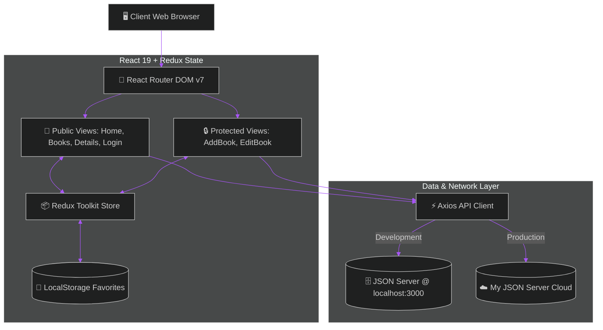

<div align="center">

<!-- Hero Banner -->


<br/>

<!-- Real-time Typewriter Animation -->
<a href="https://github.com/Nivedreddy6/LibraryManagement">
  
</a>

<br/>

<!-- Action Button Strip -->
<a href="https://library-management-six-silk.vercel.app">
  
</a>
&nbsp;
<a href="https://my-json-server.typicode.com/Nivedreddy6/LibraryManagement">
  
</a>
&nbsp;
<a href="https://github.com/Nivedreddy6/LibraryManagement/wiki">
  
</a>

<br/><br/>

<!-- Tech Stack Badges -->
<p align="center">
  
  
  
  
  
  
  
</p>

</div>

---

> [!TIP]
> **🚀 Live Web Application**: Experience the full live application in production on [**library-management-six-silk.vercel.app**](https://library-management-six-silk.vercel.app).

---

## 🧭 Documentation & Architecture Hub

<table>
  <tr>
    <td width="50%" style="padding: 6px; border: none;">
      <a href="https://github.com/Nivedreddy6/LibraryManagement/wiki/Getting-Started">
        
      </a>
    </td>
    <td width="50%" style="padding: 6px; border: none;">
      <a href="https://github.com/Nivedreddy6/LibraryManagement/wiki/Architecture-and-Tech-Stack">
        
      </a>
    </td>
  </tr>
  <tr>
    <td width="50%" style="padding: 6px; border: none;">
      <a href="https://github.com/Nivedreddy6/LibraryManagement/wiki/Features-Guide">
        
      </a>
    </td>
    <td width="50%" style="padding: 6px; border: none;">
      <a href="https://github.com/Nivedreddy6/LibraryManagement/wiki/API-Documentation">
        
      </a>
    </td>
  </tr>
</table>

---

## 🌟 Core Capabilities & Feature Showcase

<table>
  <tr>
    <td width="33%" align="center" bgcolor="#0d1117">
      <br/>
      
      <h4>📖 Rich Book Catalog</h4>
      <p align="left">Discover books with high-res covers, authors, categories, shelf locations, and reader star ratings.</p>
      
      <br/><br/>
    </td>
    <td width="33%" align="center" bgcolor="#0d1117">
      <br/>
      
      <h4>🔍 Instant Filter Engine</h4>
      <p align="left">Real-time title search, genre multi-selection, budget tiers (Low/Med/High), and rating sorting.</p>
      
      <br/><br/>
    </td>
    <td width="33%" align="center" bgcolor="#0d1117">
      <br/>
      
      <h4>❤️ Persistent Favorites</h4>
      <p align="left">Global favorites state managed via Redux Toolkit with automatic synchronization to LocalStorage.</p>
      
      <br/><br/>
    </td>
  </tr>
  <tr>
    <td width="33%" align="center" bgcolor="#0d1117">
      <br/>
      
      <h4>➕ Full CRUD Management</h4>
      <p align="left">Create, read, update, and delete books with instant optimistic state synchronization.</p>
      
      <br/><br/>
    </td>
    <td width="33%" align="center" bgcolor="#0d1117">
      <br/>
      
      <h4>🔐 Protected Routes</h4>
      <p align="left">Session-guarded routes with simulated authentication, preventing unauthorized modifications.</p>
      
      <br/><br/>
    </td>
    <td width="33%" align="center" bgcolor="#0d1117">
      <br/>
      
      <h4>☁️ Edge CDN Hosting</h4>
      <p align="left">Vercel automated deployment pipeline with SPA URL rewrite configuration rules.</p>
      
      <br/><br/>
    </td>
  </tr>
</table>

---

## 🏛️ System Architecture Blueprint



---

## 📥 Quick Start & Installation


```bash
git clone https://github.com/Nivedreddy6/LibraryManagement.git
cd LibraryManagement
```

<br/>


```bash
npm install
```

<br/>


```bash
# Terminal 1: Start Mock REST API Server
npm run server
```

<br/>


```bash
# Terminal 2: Start Vite Frontend Server
npm run dev
```

---

## 🛠️ NPM Script Reference

<table>
  <tr>
    <td width="50%" align="center" bgcolor="#0d1117">
      <br/>
      
      <br/><br/>
      <h4>⚡ <code>npm run dev</code></h4>
      <p align="left">Launches Vite development server with instant Hot Module Replacement (HMR) at <code>http://localhost:5173</code>.</p>
      
      <br/><br/>
    </td>
    <td width="50%" align="center" bgcolor="#0d1117">
      <br/>
      
      <br/><br/>
      <h4>🗄️ <code>npm run server</code></h4>
      <p align="left">Spins up local mock REST API server watching <code>db.json</code> on <code>http://127.0.0.1:3000</code> with full CRUD persistence.</p>
      
      <br/><br/>
    </td>
  </tr>
  <tr>
    <td width="50%" align="center" bgcolor="#0d1117">
      <br/>
      
      <br/><br/>
      <h4>📦 <code>npm run build</code></h4>
      <p align="left">Compiles, tree-shakes, and generates minified static production assets into the <code>/dist</code> folder.</p>
      
      <br/><br/>
    </td>
    <td width="50%" align="center" bgcolor="#0d1117">
      <br/>
      
      <br/><br/>
      <h4>🔍 <code>npm run preview</code></h4>
      <p align="left">Runs a local static server to test and inspect the compiled production build prior to cloud deployment.</p>
      
      <br/><br/>
    </td>
  </tr>
</table>

---

## 📂 Project Architecture Tree

```
LibraryManagement/
├── public/                 # Static public assets
├── src/
│   ├── app/                # Redux Store configuration (store.js)
│   ├── components/         # Reusable UI (Navbar, BookCard, Filters)
│   ├── features/           # Redux state slices (favoriteSlice.js)
│   ├── pages/              # Views (Home, Books, Details, Favorites, Auth)
│   ├── routes/             # Router config & ProtectedRoute guard
│   ├── services/           # Axios REST API client (api.js)
│   ├── App.jsx             # Root layout container
│   ├── index.css           # Global CSS variables & glassmorphism theme
│   └── main.jsx            # Application bootstrap with Redux Provider
├── db.json                 # Mock REST database for JSON Server
├── vercel.json             # SPA URL rewrite configuration for Vercel
├── package.json
└── vite.config.js
```

---

<div align="center">

<p>
  <b>Library Management System</b> • Crafted with ❤️ using <b>React 19</b>, <b>Vite</b>, and <b>Redux Toolkit</b>
</p>

[](https://github.com/Nivedreddy6/LibraryManagement)

</div>
